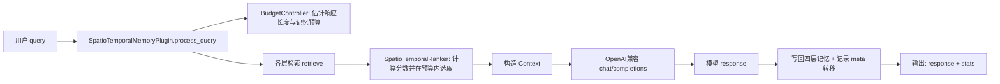
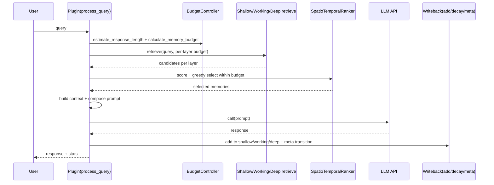

# STmemory：从源码理解的新人上手与原理说明
本说明文档以“从代码结构出发”组织内容：先解释模块边界与调用顺序，再深入到关键实现与算法思想，最后给出可复现的启动/验证手册。

代码仓库的核心目标是：为对话式 LLM 调用增加一个“分层时空记忆”中间层，减少重复上下文带来的 token 成本，并在预算内选择最有价值的历史信息参与生成。

---

# 一、项目整体概览
- 项目解决的问题（结合代码与功能）
  - 典型的多轮对话系统中，想要“记得之前说过什么”，最简单的办法是把整段历史都塞进 prompt，但这会让 token 成本随轮数线性增长，并很快触发上下文窗口限制。
  - 本项目用一个插件式编排器 [SpatioTemporalMemoryPlugin](file:///home/ubuntu/zhujingyu/STmemory/plugin.py#L65-L323) 把对话历史写入多层记忆，并在每次新查询时在 token 预算内检索、排序、拼接成“压缩上下文”，再调用上游 LLM（OpenAI 兼容接口）。
- 系统整体架构（模块划分）
  - 编排层：负责一次请求的端到端流程（预算→检索→排序→上下文→调用→写回→统计），见 [plugin.py](file:///home/ubuntu/zhujingyu/STmemory/plugin.py)
  - 记忆层：四层结构（shallow/working/deep/meta），见 [memory_layers.py](file:///home/ubuntu/zhujingyu/STmemory/memory_layers.py)
  - 排序器：把“语义相关 + 时间近因 + 层级偏好”融合成一个可比较的分值，见 [ranker.py](file:///home/ubuntu/zhujingyu/STmemory/ranker.py)
  - 预算控制：把模型 token 上限转成“可用于记忆检索的预算”，并记录使用统计，见 [budget.py](file:///home/ubuntu/zhujingyu/STmemory/budget.py)
  - 运行入口：
    - 新人推荐入口：快速体验脚本 [quick_start.py](file:///home/ubuntu/zhujingyu/STmemory/quick_start.py)
    - CLI 工具：单次 query / demo / benchmark / cleanup 等 [cli.py](file:///home/ubuntu/zhujingyu/STmemory/cli.py)
    - 可视化 Web UI：aiohttp 服务 [visual_demo/server.py](file:///home/ubuntu/zhujingyu/STmemory/visual_demo/server.py)
    - LOCOMO 基准：集成跑与服务端 [benchmark/locomo/run.py](file:///home/ubuntu/zhujingyu/STmemory/benchmark/locomo/run.py) / [benchmark/locomo/server.py](file:///home/ubuntu/zhujingyu/STmemory/benchmark/locomo/server.py)
- 核心数据流 / 请求流（从输入到输出的路径）



---

# 二、代码结构解析（按目录逐层展开）
本仓库代码“扁平化”较强：核心逻辑几乎都在根目录的几个 .py 文件中；benchmark 与 web demo 则在子目录。

- 根目录（核心实现）
  - [plugin.py](file:///home/ubuntu/zhujingyu/STmemory/plugin.py)：系统编排入口（最重要）。对外暴露：
    - `SpatioTemporalMemoryPlugin.process_query()`：一次查询的端到端处理
    - `retrieve_relevant_memories()`：只做检索与上下文构建
    - `make_openai_compatible_api_func()`：把 OpenAI 兼容的 `/v1/chat/completions` 封装为一个 `async(prompt)->str` 的可调用对象
  - [memory_layers.py](file:///home/ubuntu/zhujingyu/STmemory/memory_layers.py)：四层记忆与统一接口
    - `MemoryEntry`：一条记忆的最小数据结构（含 token_count、timestamp、layer、embedding）
    - `ShallowMemoryLayer`：LRU + TTL 的短期缓存
    - `WorkingMemoryLayer`：摘要 + 关键词检索 + TTL 的中期缓存
    - `DeepMemoryLayer`：SQLite 持久化 + entity->entry_ids 的轻量“知识图谱”索引
    - `MetaMemoryLayer`：访问日志与层级转移统计（用于后续更新转移矩阵）
  - [ranker.py](file:///home/ubuntu/zhujingyu/STmemory/ranker.py)：时空排序器
    - 优先用 SentenceTransformer 向量；加载失败则回退 `_HashEmbeddingModel`
    - `select_memories_within_budget()`：在预算约束下做“按分值贪心选择”
  - [budget.py](file:///home/ubuntu/zhujingyu/STmemory/budget.py)：token 预算模型
    - `calculate_memory_budget()`：把 max_tokens 变成“记忆可用预算”
    - `check_budget_constraints()`：检查 memory+response 是否超限
  - [quick_start.py](file:///home/ubuntu/zhujingyu/STmemory/quick_start.py)：最短路径可运行示例（默认 mock LLM，不依赖外部 API）
  - [cli.py](file:///home/ubuntu/zhujingyu/STmemory/cli.py)：click CLI；主要用于演示与统计导出
  - [README.md](file:///home/ubuntu/zhujingyu/STmemory/README.md)：项目概览与使用说明（其中部分“Redis/压缩率”等描述偏愿景，建议以源码为准）
- visual_demo/（可视化 UI）
  - [visual_demo/server.py](file:///home/ubuntu/zhujingyu/STmemory/visual_demo/server.py)：aiohttp Web 服务 + WebSocket 推送；内部创建 `SpatioTemporalMemoryPlugin` 驱动对话
  - visual_demo/static/：前端静态资源
- benchmark/（基准与 shim）
  - benchmark/locomo/：LOCOMO 数据集与脚本
    - [benchmark/locomo/run.py](file:///home/ubuntu/zhujingyu/STmemory/benchmark/locomo/run.py)：一键编排（拉起服务→跑 add/search→评估→生成报告）
    - [benchmark/locomo/server.py](file:///home/ubuntu/zhujingyu/STmemory/benchmark/locomo/server.py)：aiohttp API（/healthz、/search、/add_memories…），内部复用 `SpatioTemporalMemoryPlugin`
    - benchmark/locomo/methods/：LOCOMO 方法脚本（add/search）通过 HTTP 调用 server
  - benchmark/shims/：为 LOCOMO 评测准备的轻量 shim（例如 openai）

- 各模块之间的调用关系（谁调用谁）
  - 推荐主路径（新人理解顺序）：
    1) [quick_start.py](file:///home/ubuntu/zhujingyu/STmemory/quick_start.py) 创建插件 → 调用 [SpatioTemporalMemoryPlugin.process_query](file:///home/ubuntu/zhujingyu/STmemory/plugin.py#L225-L300)
    2) `process_query()` 内部先 `retrieve_relevant_memories()` → 调用 [BudgetController](file:///home/ubuntu/zhujingyu/STmemory/budget.py) 计算预算 → 调用各层 `retrieve()`（[memory_layers.py](file:///home/ubuntu/zhujingyu/STmemory/memory_layers.py)）→ 调用 [SpatioTemporalRanker.select_memories_within_budget](file:///home/ubuntu/zhujingyu/STmemory/ranker.py#L197-L277)
    3) 选中的记忆被拼成 context → 调用上游 LLM（mock 或 [make_openai_compatible_api_func](file:///home/ubuntu/zhujingyu/STmemory/plugin.py#L17-L62)）
    4) 返回后写回四层（[plugin.py:_update_memories_async](file:///home/ubuntu/zhujingyu/STmemory/plugin.py#L302-L323)）

---

# 三、核心模块原理与算法解析（重点）

## 3.1 分层记忆（memory_layers.py）
1) 模块功能
  - 把“短期、工作、中长期、元信息”拆成不同的数据结构与策略，避免一个存储同时承担“低延迟 + 高容量 + 强相关检索 + 可解释统计”的矛盾需求。
2) 核心实现逻辑（代码级）
  - 统一接口：`add/retrieve/decay/get_stats`，见 [MemoryLayer](file:///home/ubuntu/zhujingyu/STmemory/memory_layers.py#L41-L69)
  - Shallow：OrderedDict 做 LRU；`decay()` 基于 TTL 清理，见 [ShallowMemoryLayer](file:///home/ubuntu/zhujingyu/STmemory/memory_layers.py#L76-L146)
  - Working：写入时生成简易摘要（截断）并存 metadata；检索时做关键词命中计分排序，见 [WorkingMemoryLayer](file:///home/ubuntu/zhujingyu/STmemory/memory_layers.py#L148-L243)
  - Deep：写入时做实体抽取 `_extract_entities()`（长度>3 的词）并维护 `knowledge_graph: entity -> entry_ids`；同时持久化 SQLite，见 [DeepMemoryLayer](file:///home/ubuntu/zhujingyu/STmemory/memory_layers.py#L245-L387)
  - Meta：记录访问日志与层级转移次数，并可导出转移矩阵，见 [MetaMemoryLayer.get_transition_matrix](file:///home/ubuntu/zhujingyu/STmemory/memory_layers.py#L461-L475)
3) 底层原理或算法
  - “缓存层级”思想：用 LRU/TTL 把最近性（recency）显式化；本质是对时间局部性的利用。
  - Deep 层的 `knowledge_graph` 是一种极简倒排索引：实体→文档集合（entry_ids），可视为“以实体为键的检索加速结构”，牺牲了准确的 NLP 实体识别，换取低实现复杂度与可解释性。
4) 为什么这样设计（trade-off）
  - Shallow/Working/Deep 三层把“速度、预算、覆盖范围”拉开梯度：越浅越快、越深越全。
  - 代价是数据冗余：同一轮对话被写入三层（[plugin.py:_update_memories_async](file:///home/ubuntu/zhujingyu/STmemory/plugin.py#L302-L314)），但不同层用不同检索策略，属于“用冗余换检索可用性”的典型工程取舍。

## 3.2 时空排序与预算内选择（ranker.py）
1) 模块功能
  - 把各层检索得到的候选集合合并，计算统一分值，并在 token 预算约束下选择一个子集用于构造上下文。
2) 核心实现逻辑
  - 分值分解：`score = α * similarity + β * time + γ * P(layer)`，见 [compute_spatiotemporal_score](file:///home/ubuntu/zhujingyu/STmemory/ranker.py#L147-L175)
  - 语义相似：
    - 正常路径：SentenceTransformer 编码 + 余弦相似度，见 [compute_semantic_similarity](file:///home/ubuntu/zhujingyu/STmemory/ranker.py#L108-L131)
    - 降级路径：加载失败时回退 `_HashEmbeddingModel`（token 哈希计数 + L2 归一），见 [ranker.py](file:///home/ubuntu/zhujingyu/STmemory/ranker.py#L27-L43) 与 [_load_model](file:///home/ubuntu/zhujingyu/STmemory/ranker.py#L55-L65)
  - 时间近因：指数衰减 `w(t)=exp(-λΔt)`，见 [compute_time_decay](file:///home/ubuntu/zhujingyu/STmemory/ranker.py#L101-L107)
  - 层级偏好：初始化转移矩阵（自环 0.6、相邻 0.3、其余 0.1），见 [_init_transition_matrix](file:///home/ubuntu/zhujingyu/STmemory/ranker.py#L76-L93)
  - 预算内选取：对候选按分值降序，然后“贪心加入直到 token 超预算”为止，见 [select_memories_within_budget](file:///home/ubuntu/zhujingyu/STmemory/ranker.py#L197-L277)
3) 底层原理或算法（重点）
  - 这是一个带约束的选择问题：在预算（token）上限下选择若干条记忆最大化“上下文价值”。形式上接近 0/1 背包（knapsack）。
  - 当前实现使用“按分数排序 + 贪心装入”近似求解（[ranker.py](file:///home/ubuntu/zhujingyu/STmemory/ranker.py#L259-L273)）。它的优点是简单、可解释、线性可扩展；缺点是最优性不保证，尤其当不同记忆 token 成本差异大时，按“score/成本”比值选取可能更好。
4) 为什么这样设计（trade-off）
  - 面向在线推理：排序+贪心是 O(n log n) 级别，适合每次请求都运行；而精确背包或更复杂的学习排序会引入更高的延迟与工程复杂度。

## 3.3 Token 预算控制（budget.py）
1) 模块功能
  - 把模型的 max_tokens/context_window 转成“本次最多能塞多少历史记忆”，并在调用后更新统计（节省 token、成本估算等）。
2) 核心实现逻辑
  - `calculate_memory_budget()`：从 `max_tokens * optimal_budget_ratio` 出发，减去 system prompt 预留与 response buffer，得到记忆预算，见 [budget.py](file:///home/ubuntu/zhujingyu/STmemory/budget.py#L105-L134)
  - `estimate_response_length()`：用启发式规则估计回答长度，见 [budget.py](file:///home/ubuntu/zhujingyu/STmemory/budget.py#L151-L178)
3) 底层原理或算法
  - 本质是容量规划：把上下文窗口当作“有限资源”，给 system prompt/记忆/回答分配份额。这里用启发式而非精确 tokenization，是典型的“用估算换速度与依赖简化”。
4) 为什么这样设计（trade-off）
  - 精确 token 计数通常要绑定某个 tokenizer（例如 tiktoken/特定模型），会带来依赖与模型耦合；本项目选择了近似估算（[plugin.py:_estimate_token_count](file:///home/ubuntu/zhujingyu/STmemory/plugin.py#L124-L134)）以保持轻量。

## 3.4 编排器（plugin.py）：把系统设计落到“可跑的请求链路”
1) 模块功能
  - 统一入口：给上游一个 `query -> response` 的接口，但内部自动做“记忆增强”。
2) 核心实现逻辑（执行顺序非常关键）
  - 先检索再生成：`retrieve_relevant_memories()` 在生成前构建 context，[plugin.py](file:///home/ubuntu/zhujingyu/STmemory/plugin.py#L181-L223)
  - 再调用 LLM：有 context 则拼接成 `Context ... Current query ...`，见 [process_query](file:///home/ubuntu/zhujingyu/STmemory/plugin.py#L244-L254)
  - 最后写回：把本轮写入 shallow/working/deep，并在 meta 里记录层级转移，见 [_update_memories_async](file:///home/ubuntu/zhujingyu/STmemory/plugin.py#L302-L323)
3) “数据筛选 / 数据加权 / 数据价值评估”视角
  - 筛选发生在两段：
    - 各层 `retrieve()` 自带粗筛（按时间/关键词/实体）
    - `SpatioTemporalRanker` 做统一评分并在预算内选子集（最终“价值评估器”）
  - 加权体现在 `α/β/γ`：语义 vs 近因 vs 层级偏好，见 [MemoryConfig](file:///home/ubuntu/zhujingyu/STmemory/memory_layers.py#L24-L39) 与 [compute_spatiotemporal_score](file:///home/ubuntu/zhujingyu/STmemory/ranker.py#L160-L166)
4) 为什么这样设计（trade-off）
  - 先检索再生成能显著减少 prompt 大小，但也引入“检索错误导致生成偏离”的风险；因此系统保留了多层候选与多因子评分，以降低单一信号失真带来的损失。

---

# 四、项目启动流程（完整操作指南）
下面以“最稳妥可跑通”为目标组织步骤：先跑 mock（不依赖外部 LLM），再切到真实 LLM，再扩展到可视化与基准。

## 4.1 获取代码
```bash
git clone <你的仓库地址> STmemory
cd STmemory
```

## 4.2 环境准备
- 推荐：Python 3.10+（代码最低要求见 [quick_start.py](file:///home/ubuntu/zhujingyu/STmemory/quick_start.py#L166-L170) 为 3.8+）
```bash
python3 -V
python3 -m venv .venv
source .venv/bin/activate
python -m pip install -U pip
```

## 4.3 依赖安装
仓库根目录的 [requirements.txt](file:///home/ubuntu/zhujingyu/STmemory/requirements.txt) 包含若干标准库条目（如 `json/os/asyncio/sqlite3`）与 `sklearn` 等，某些环境下可能导致 `pip install -r requirements.txt` 失败。

推荐两种方式（二选一）：

- 方式 A：直接按核心依赖安装（更稳）
```bash
python -m pip install numpy scipy torch transformers sentence-transformers scikit-learn aiohttp click pytest pytest-cov
```

- 方式 B：尝试按 requirements.txt 安装（若失败再用方式 A）
```bash
python -m pip install -r requirements.txt
```

LOCOMO 基准额外依赖：
```bash
python -m pip install -r benchmark/requirements.txt
```

## 4.4 配置文件修改
本项目有两类“配置”：
- 运行时配置（真实生效）：通过构造 [MemoryConfig](file:///home/ubuntu/zhujingyu/STmemory/memory_layers.py#L24-L39) 传入插件（见 [quick_start.py](file:///home/ubuntu/zhujingyu/STmemory/quick_start.py#L31-L42)、[visual_demo/server.py](file:///home/ubuntu/zhujingyu/STmemory/visual_demo/server.py#L227-L241)、[benchmark/locomo/server.py](file:///home/ubuntu/zhujingyu/STmemory/benchmark/locomo/server.py#L98-L105)）。
- 文档型/示例型配置：根目录 [config.json](file:///home/ubuntu/zhujingyu/STmemory/config.json) 更像 README 的示例参数集合；当前核心插件构造函数并不会直接读取它。

真实 LLM 配置（OpenAI 兼容 `/v1/chat/completions`）：
- 环境变量（推荐）：
  - `LLM_API_KEY` 或 `OPENAI_API_KEY`
  - `LLM_BASE_URL` 或 `OPENAI_BASE_URL`（例：`https://api.openai.com/v1` 或你的私有网关）
  - `LLM_MODEL`（例：`gpt-4o-mini`）
- 或命令行参数：见 [quick_start.py](file:///home/ubuntu/zhujingyu/STmemory/quick_start.py#L150-L155)

## 4.5 数据准备（如果有）
- 默认无需额外数据：shallow/working 在内存中；deep 默认 SQLite 文件 `deep_memory.db`（见 [MemoryConfig.deep_persist_path](file:///home/ubuntu/zhujingyu/STmemory/memory_layers.py#L31)），会在首次写入时自动创建目录/文件。
- LOCOMO 基准自带数据集：`benchmark/locomo/dataset/locomo10.json`（由 [benchmark/locomo/run.py](file:///home/ubuntu/zhujingyu/STmemory/benchmark/locomo/run.py#L137-L138) 检查）。

## 4.6 服务启动
启动顺序按“依赖最少→依赖更多”：

1) 最小可运行（mock LLM）
```bash
python quick_start.py
```

2) 使用真实 LLM（OpenAI 兼容）
```bash
export LLM_API_KEY="***"
export LLM_BASE_URL="https://api.openai.com/v1"
export LLM_MODEL="gpt-4o-mini"
python quick_start.py --use-llm
```

3) CLI 演示（mock）
```bash
python cli.py demo -n 5
python cli.py stats
```

4) 可视化 Web UI
```bash
python -m visual_demo.server --host 127.0.0.1 --port 8765
```

5) LOCOMO 基准（集成跑，自动拉起本地服务）
```bash
python -m benchmark.locomo.run --use-mock-openai
```

---

# 五、模块启动顺序与依赖关系
本项目大多数功能是“单进程即可跑通”的；只有在开启 Web UI 或基准时才会多出一个本地 HTTP 服务进程。

- 单机脚本路径（最快）
  - Python 解释器 → 直接运行脚本（[quick_start.py](file:///home/ubuntu/zhujingyu/STmemory/quick_start.py)、[demo.py](file:///home/ubuntu/zhujingyu/STmemory/demo.py)、[cli.py](file:///home/ubuntu/zhujingyu/STmemory/cli.py)）
  - 依赖：Python + pip 包（torch/transformers/sentence-transformers…）；无外部数据库/缓存强依赖
- 真实 LLM 路径（外部依赖）
  - 本地脚本 → HTTP 调用外部 LLM 网关（由 [make_openai_compatible_api_func](file:///home/ubuntu/zhujingyu/STmemory/plugin.py#L17-L62) 发起）
  - 必须先保证：`base_url/api_key/model` 可用，否则会在请求时抛错（[plugin.py](file:///home/ubuntu/zhujingyu/STmemory/plugin.py#L24-L60)）
- Web UI 路径（本地服务）
  - 先启动 `visual_demo.server` → 浏览器访问静态页面 → WebSocket/HTTP 交互驱动插件
  - 顺序错误的表现：浏览器打不开/WS 连接失败/接口 404
- LOCOMO 基准路径（本地服务 + 子进程）
  - `benchmark.locomo.run` 先拉起 `benchmark.locomo.server` 并等待 `/healthz`（[run.py](file:///home/ubuntu/zhujingyu/STmemory/benchmark/locomo/run.py#L34-L45)）→ 再运行 `run_experiments.py`（子进程）→ 再评测与汇总
  - 顺序错误的表现：run 脚本报 “Server not ready” 或 server 进程提前退出（[run.py](file:///home/ubuntu/zhujingyu/STmemory/benchmark/locomo/run.py#L48-L72)）

---

# 六、关键节点验证方法（非常重要）
- 核心插件可用（脚本级）
  - 运行：
    - `python quick_start.py`
  - 成功标志：
    - 输出 “系统初始化完成” 且每轮对话能打印 `相关记忆: N条`（见 [quick_start.py](file:///home/ubuntu/zhujingyu/STmemory/quick_start.py#L94-L118)）
  - 常见错误排查：
    - ImportError：先装依赖（脚本已提示），见 [quick_start.py](file:///home/ubuntu/zhujingyu/STmemory/quick_start.py#L15-L22)
    - SentenceTransformer 模型加载失败：ranker 会回退哈希 embedding（[ranker.py](file:///home/ubuntu/zhujingyu/STmemory/ranker.py#L55-L65)），一般不影响跑通，只会影响“语义检索质量”
- Web UI 服务可用
  - 运行：`python -m visual_demo.server --host 127.0.0.1 --port 8765`
  - 成功标志：浏览器打开 `http://127.0.0.1:8765/` 能看到页面并能触发对话
  - 排查：
    - 端口被占用：换 `--port`
    - aiohttp 缺失：安装 `aiohttp`
- LOCOMO server 可用
  - 运行：`python -m benchmark.locomo.server --host 127.0.0.1 --port 8000`
  - 成功标志：
    - `curl http://127.0.0.1:8000/healthz` 返回 `{"status":"ok"}`（路由见 [server.py](file:///home/ubuntu/zhujingyu/STmemory/benchmark/locomo/server.py#L214-L216)）
  - 排查：
    - 启动后立刻退出：检查依赖/端口/日志输出
- 单元测试（保证核心逻辑没有回归）
  - 运行：
```bash
pytest -q
```

---

# 七、系统运行流程（端到端）
以下以“一个 query 的完整路径”为例，把模块串起来（等价于 [SpatioTemporalMemoryPlugin.process_query](file:///home/ubuntu/zhujingyu/STmemory/plugin.py#L225-L290) 的执行）。



关键点（为什么这样流转）：
- “先检索再生成”：让 LLM 用更少 token 获得“足够的历史信息”，避免全量历史带来的成本爆炸。
- “分层检索 + 统一排序”：用不同策略生成候选，再用统一评分函数整合，降低单一检索策略的失败风险。
- “写回所有层”：保证下一轮能从不同粒度/不同策略中检索到相关信息（代价是冗余与更高写入成本，但写入是本地操作且可接受）。

---

# 八、设计总结与可扩展性分析
- 当前系统的优点
  - 端到端路径清晰：入口脚本 → 插件编排 → 层/排序/预算三个可替换模块，便于新人定位与替换。
  - 算法可解释：评分函数可拆解为语义、时间、层级三项，易于做 ablation 与调参（[ranker.py](file:///home/ubuntu/zhujingyu/STmemory/ranker.py#L160-L166)）。
  - 可降级运行：向量模型不可用时仍可用哈希 embedding 跑通流程（[ranker.py](file:///home/ubuntu/zhujingyu/STmemory/ranker.py#L55-L65)）。
- 潜在瓶颈
  - 检索质量：Working 的关键词匹配与 Deep 的简易实体抽取在真实对话中会偏脆弱，容易漏召回或误召回。
  - 预算最优性：当前是“按分值贪心装入”，不是最优 knapsack；当 token 成本差异大时可能浪费预算。
  - 数据冗余：同一轮写入三层，长期运行会带来存储增长与更多候选排序开销。
- 可以改进的方向（特别是数据管理或数据估值相关）
  - 用“价值/成本比”或近似 knapsack（例如按 `score/token_count`）替换纯分值贪心，提高预算利用率。
  - 引入记忆“晋升/降级”机制：不是每轮都写入 deep，而是基于置信度/重复度/主题稳定性做选择，减少冗余写入。
  - 将“元记忆”变成可学习的调度器：利用 [MetaMemoryLayer.get_transition_matrix](file:///home/ubuntu/zhujingyu/STmemory/memory_layers.py#L461-L475) 的统计结果在线更新 `layer_transition_matrix`（ranker 已预留 [update_transition_matrix](file:///home/ubuntu/zhujingyu/STmemory/ranker.py#L279-L284)）。
  - Deep 层索引升级：从简易实体抽取升级为倒排索引/ANN 向量索引（FAISS/HNSW 等），或为 entity 引入更可靠的 NER。

