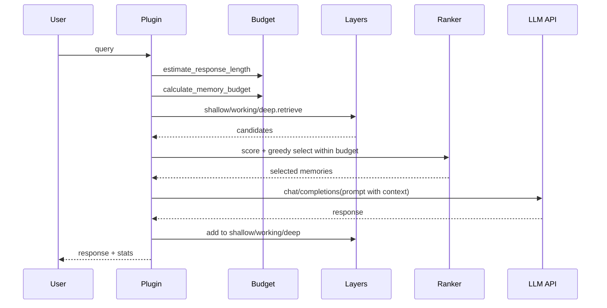
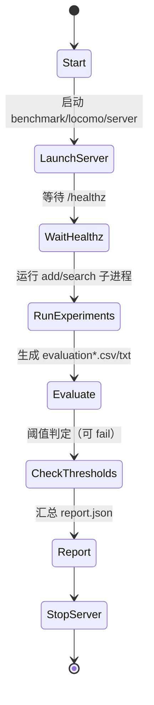

# 系统架构与运行流程（STmemory）

本项目是“推理期（inference-time）记忆增强”系统：通过分层时空记忆 + 预算 + 排序，减少重复上下文带来的 token 成本，并提升多轮对话的相关性与可解释性。

核心入口：
- 插件编排器：[plugin.py](../plugin.py)
- 分层记忆：[memory_layers.py](../memory_layers.py)
- 排序器：[ranker.py](../ranker.py)
- 预算控制：[budget.py](../budget.py)

## 1. 系统架构图（模块关系 + 数据流）

```mermaid
flowchart TB
  U[User / Client] -->|query| P[SpatioTemporalMemoryPlugin]
  P --> B[BudgetController]
  P --> L[Memory Layers]
  L --> SM[ShallowMemory]
  L --> WM[WorkingMemory]
  L --> DM[DeepMemory (SQLite + VectorStore)]
  L --> MM[MetaMemory]
  P --> R[SpatioTemporalRanker]
  R --> TM[Temporal Model]
  DM --> VS[VectorStore: numpy/sqlite/qdrant]
  P -->|prompt| LLM[OpenAI-compatible LLM API]
  LLM -->|response| P
  P -->|writeback| L
  P -->|stats| U
```

数据流要点：
- 读路径：query → 预算 → 各层候选 → 排序/预算内选择 → context → LLM
- 写路径：response → 写入 shallow/working/deep → meta 记录层级转移/访问

## 2. 框架实现流程（分阶段）

用户期望的通用 ML 流程（初始化→数据→预处理→训练→评估→导出→部署）在本项目中的对应关系如下：

| 阶段 | 本项目对应 | 是否存在 |
|---|---|---|
| 环境初始化 | Python 依赖安装、LLM 与向量库可用性检查 | 是 |
| 数据加载 | DeepMemory 从 SQLite 加载历史条目；LOCOMO 加载数据集 JSON | 是 |
| 预处理 | token 估算、压缩、时间范围解析、实体/term 提取 | 是 |
| 模型训练 | 无训练管线（不训练 LLM/Embedding） | 否 |
| 评估验证 | 单元测试；LOCOMO benchmark（集成跑与报告） | 是 |
| 模型导出 | 无（模型由外部服务提供） | 否 |
| 推理部署 | CLI/可视化服务/LOCOMO server | 是 |

### 2.1 阶段 1：环境初始化

关键检查点：
- 依赖：`sentence-transformers/torch/aiohttp/click` 等是否可导入
- LLM：
  - remote：`LLM_API_KEY`/`OPENAI_API_KEY` 是否配置
  - local：本地 OpenAI-compatible `/v1/models` 是否可访问（见 [plugin.py](../plugin.py#L68-L134)）
- 向量库（可选）：provider=qdrant 时 `qdrant-client` 与 Qdrant 服务是否可用

异常处理机制（主链路）：
- LLM 调用失败：`process_query` 捕获异常并返回 `status="error"`（见 [plugin.py](../plugin.py#L522-L530)）
- Embedding 模型加载失败：排序器回退哈希 embedding（见 [ranker.py](../ranker.py#L57-L70)）

### 2.2 阶段 2：数据加载

- DeepMemory：
  - SQLite schema 初始化/迁移（`_init_database/_ensure_schema`）
  - 从 SQLite 加载条目与时间排序索引（`_load_from_database`）
- LOCOMO：
  - 读取数据集：`benchmark/locomo/dataset/locomo10.json`

### 2.3 阶段 3：预处理

- 近似 token：`compression.estimate_tokens`
- 压缩（Deep 写入）：`MemoryCompressor.compress_to_target`
- 时间解析：`temporal_model.parse_time_range_from_query`
- Deep 候选重排：词面 term overlap + 时间匹配融合（见 [memory_layers.py](../memory_layers.py#L823-L859)）

### 2.4 阶段 4：推理（训练阶段缺失，直接进入推理）

一次 query 的关键链路（与 [plugin.py](../plugin.py#L453-L520) 对应）：



### 2.5 阶段 5：评估验证（LOCOMO）

LOCOMO 集成跑的状态机（摘要）：



关键检查点：
- `/healthz` 可用（否则集成跑中止）
- 子进程退出码为 0（否则记录日志并失败）

## 3. 配置模板与调优入口

配置与调优建议集中在：
- `docs/configuration/overview.md`
- 示例配置：`config.memory_config.example.json`、`benchmark/locomo/config.example.json`
