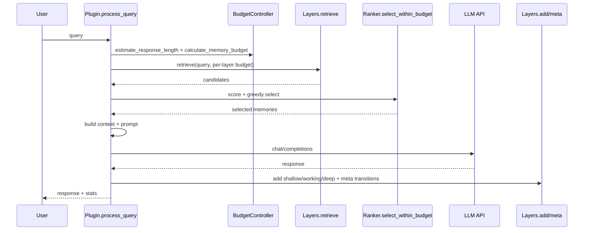

# plugin：编排器（参数与算法原理）

对应源码：[plugin.py](../../plugin.py)。

## 1. 模块职责

- 提供统一入口：`query -> response`，在内部完成“预算→检索→排序→构造上下文→调用 LLM→写回→统计”。
- 封装 OpenAI 兼容的 `/chat/completions` 调用，并支持本地 LLM（Ollama/OpenAI-compat）可用性检测。

## 2. 对外接口（输入/输出）

### 2.1 SpatioTemporalMemoryPlugin

初始化：

| 参数 | 类型 | 默认值 | 说明 |
|---|---|---:|---|
| model_name | str | openclaw-medium | 预算控制器的模型名（与 LLM 实际模型名可不同） |
| memory_config | Optional[MemoryConfig] | None | 记忆系统配置（None 时使用默认 `MemoryConfig()`） |
| enable_logging | bool | True | 仅控制 stdout 打印 |

主入口：

| 方法 | 输入 | 输出 | 说明 |
|---|---|---|---|
| process_query | query: str, openclaw_api_func: Optional[callable] | Dict[str,Any] | 端到端处理一次查询 |
| retrieve_relevant_memories | query: str | (context: str, memory_tokens: int, memories: List[MemoryEntry]) | 只做检索/排序/上下文构建 |
| vector_search | query: str, top_k: int, distance: str | Dict[str,Any] | 调用 Deep 的向量搜索（调试/可视化用） |
| get_performance_stats | - | Dict[str,Any] | 性能/预算/排序器统计 |
| get_vector_store_stats | - | Dict[str,Any] | 向量库统计（Qdrant 计数/耗时/错误等） |

`process_query` 返回字段（关键子集）：
- `response/context/memory_tokens/response_tokens/total_tokens/latency_ms`
- `budget_check`（是否超限、比例等）
- `relevant_memories_count`

## 3. 参数与配置来源

### 3.1 LLM 调用配置（MemoryConfig）

字段定义见 [MemoryConfig](../../memory_layers.py#L30-L98)。本模块主要使用：

| 参数 | 类型 | 默认值 | 取值范围/约束 | 依赖/影响 |
|---|---|---:|---|---|
| llm_provider | str | ollama | `ollama/local/remote` 等 | 选择调用路径（见 [make_configured_llm_api_func](../../plugin.py#L157-L192)） |
| llm_base_url | str | https://api.openai.com/v1 | 非空 | provider=remote 时使用（OpenAI-compatible） |
| llm_model | str | gpt-4o-mini | 非空 | provider=remote 时使用 |
| local_llm_base_url | str | http://localhost:11434/v1 | 非空 | provider=local/ollama 时使用 |
| local_llm_model | str | qwen3.5-9b | 非空 | provider=local/ollama 时使用 |
| local_llm_timeout_s | int | 60 | ≥1 | 本地调用超时 |
| local_llm_check | bool | True | - | 是否在首次调用前探测模型可用性 |

环境变量：
- 远端 key：`LLM_API_KEY` 或 `OPENAI_API_KEY`（见 [make_configured_llm_api_func](../../plugin.py#L184-L192)）

### 3.2 预算与检索分配

预算由 [BudgetController](../../budget.py) 计算（见 [retrieve_relevant_memories](../../plugin.py#L384-L389)），随后按层权重拆分预算：
- shallow：1.0
- working：1.0
- deep：2.0

实现细节：[plugin.py](../../plugin.py#L392-L410)。

## 4. 核心流程文档化（伪代码 + 时序）

### 4.1 端到端伪代码

```text
process_query(query):
  llm = openclaw_api_func or make_configured_llm_api_func(config)

  (context, mem_tokens, memories) = retrieve_relevant_memories(query)
  prompt = query if context empty else "Context...\n{context}\n\nCurrent query: {query}"

  response = llm(prompt)
  resp_tokens = estimate_tokens(response)
  check budget(mem_tokens, resp_tokens)
  update usage stats

  writeback to shallow/working/deep
  record meta transitions
  update performance stats + query log
  return result dict
```

### 4.2 时序图（一次 query）



## 5. 复杂度分析

记各层候选总数为 n，向量维度为 d：
- 预算分配：O(1)
- 各层检索：与各层实现相关（见 `docs/modules/memory_layers.md`）
- 排序：O(n log n) +（可选）O(n·d) 的向量相似计算
- 写回：O(1)~O(log n)（Deep 还会涉及 SQLite 写入与可选向量 upsert）

## 6. 异常处理与边界条件

- LLM 调用异常会被捕获并返回 `status="error"`（见 [process_query](../../plugin.py#L479-L487)）。
- 本地 LLM 可用性探测失败时直接报错（见 [ConfiguredLLMCaller.__call__](../../plugin.py#L136-L167)）。
- Deep 向量索引只有在 `deep.set_encoder(ranker._encode_texts)` 成功后才会进入“向量候选”分支。
